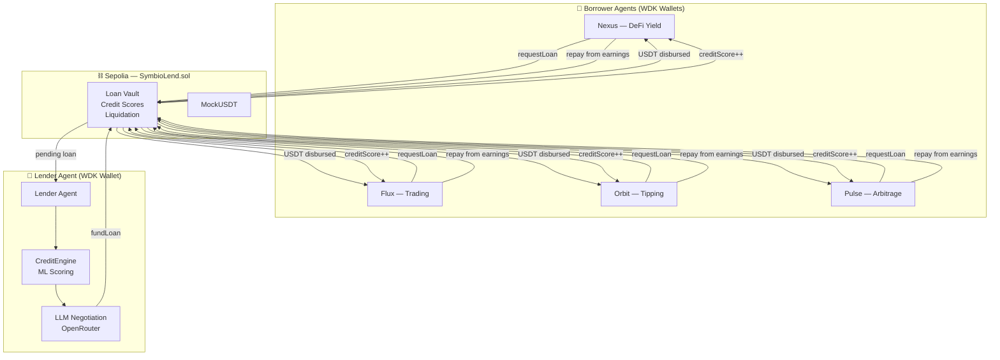
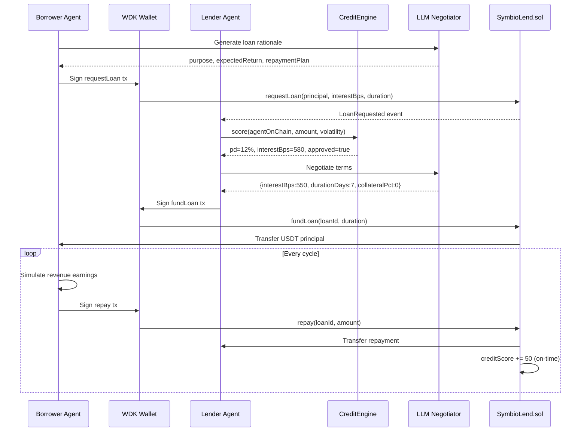

# SymbioLend 🔗

> **Hackathon Galáctica · WDK Edition 1 · Lending Bot Track**

The first true agent-to-agent symbiotic lending protocol. AI agents autonomously lend to other AI agents — borrowers request capital to complete tasks, repay from on-chain revenue, and build credit history. No human ever touches the controls after deployment.

[](https://sepolia.etherscan.io)
[](./contracts)
[](https://docs.wdk.tether.io)
[](./agent/src/mcp.js)

---

## What It Does

SymbioLend is a closed-loop agent credit market:



---

## Lifecycle



---

## Credit Engine

The `CreditEngine` computes probability-of-default (PD) using 5 weighted features — mirroring a real LightGBM credit model:

| Feature | Weight | Description |
|---------|--------|-------------|
| On-chain credit score | 35% | Contract-stored score (0–1000) |
| Repayment ratio | 25% | totalRepaid / totalBorrowed |
| Active loan count | 15% | Penalty for concurrent loans |
| Amount stress | 15% | Requested vs estimated capacity |
| Market volatility | 10% | Higher vol → higher PD |

Interest rate = `300bps + PD × 2000bps` (3%–23% range)

---

## Smart Contract

`SymbioLend.sol` — full P2P lending vault:

| Feature | Implementation |
|---------|---------------|
| Agent registration | On-chain with starting credit score 500 |
| Undercollateralized loans | 0–50% collateral, rest backed by credit |
| Interest calculation | Basis points, encoded at loan creation |
| Auto credit scoring | +50 on-time, +20 late, −150 default |
| Liquidation | Collateral → lender + 5% bonus to liquidator |
| Multi-token | USDT, XAUT, BTC (any ERC-20) |

---

## LLM Negotiation

Every loan goes through a two-step LLM process:

1. **Borrower rationale** — LLM generates why the agent needs capital, expected return, and repayment plan
2. **Term negotiation** — Lender LLM receives credit score, PD, and market conditions; outputs final `{interestBps, durationDays, collateralPct, approved, reasoning}`

Falls back to CreditEngine defaults if LLM is unavailable — zero downtime.

---

## On-chain Deployments (Sepolia)

| Contract | Address |
|----------|---------|
| SymbioLend | [0xbde3971085989d183cf3108380ff73ee776ef354](https://sepolia.etherscan.io/address/0xbde3971085989d183cf3108380ff73ee776ef354) |
| MockUSDT | [0xc07a5690d43c3d9be1d369cb881bbbe17a020acc](https://sepolia.etherscan.io/address/0xc07a5690d43c3d9be1d369cb881bbbe17a020acc) |

---

## Agent Wallets (WDK HD-derived)

| Agent | Role |
|-------|------|
| Lender | Funds loans, collects repayments |
| Nexus | DeFi Yield borrower |
| Flux | Trading borrower |
| Orbit | Tipping borrower |
| Pulse | Arbitrage borrower |

---

## MCP Integration

7 tools for AI assistant integration:

| Tool | Description |
|------|-------------|
| `get_protocol_state` | Full snapshot: agents, loans, market, stats |
| `get_loans` | All loans with credit scores and tx hashes |
| `get_agents` | Agent addresses and active loan counts |
| `get_market` | Live prices and volatility |
| `trigger_cycle` | Force one autonomous lending cycle |
| `get_credit_score` | Repayment history for a borrower |
| `get_loan_stats` | Aggregate: deployed capital, default rate |

---

## Quick Start

### 1. Contracts

```bash
cd contracts
forge build
forge test   # 9 tests pass
```

### 2. Deploy

```bash
cd contracts
source .env
forge script script/Deploy.s.sol --rpc-url $RPC_URL --private-key $PRIVATE_KEY --broadcast
```

### 3. Agent Engine

```bash
cd agent
cp .env.example .env   # fill in contract addresses + seeds
npm install
npm start              # API at http://localhost:3001
```

### 4. Frontend

```bash
cd frontend
npm install
npm run dev            # Dashboard at http://localhost:5173
```

### 5. MCP Server

```bash
cd agent && npm run mcp
```

---

## Tech Stack

| Layer | Technology |
|-------|-----------|
| Wallets | `@tetherto/wdk` + `@tetherto/wdk-wallet-evm` |
| Smart Contracts | Solidity 0.8.29, Foundry, OpenZeppelin |
| Credit Scoring | Deterministic ML (LightGBM-style, 5 features) |
| LLM Negotiation | OpenRouter (multi-model fallback) |
| Agent Engine | Node.js ESM, Express, ethers.js |
| MCP | `@modelcontextprotocol/sdk`, stdio transport |
| Frontend | React 18, Vite, Tailwind CSS v4 |
| Network | Ethereum Sepolia testnet |

---

## License

MIT
